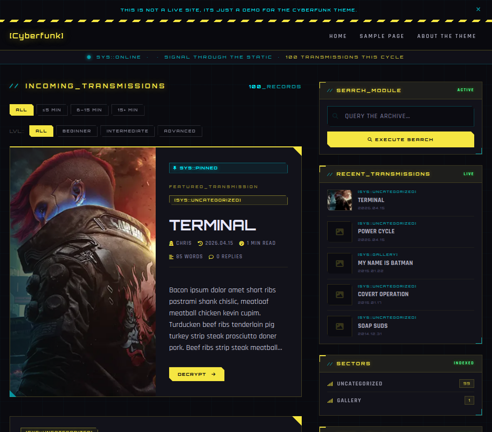

# Cyberfunk

A cyberpunk styled WordPress theme

## Features

### 🎨 Design & Visual Style
- 🌑 **Dark cyberpunk aesthetic** — Deep black backgrounds with neon yellow and cyan accent colours throughout
- 🤖 **Sci-Fi HUD style** — Switch to a second full visual style in Customizer: cold cyan palette, Share Tech Mono body font, corner-bracket card panels, reticle status dot, and a tighter grid overlay — no rebuild required
- 🔤 **Custom futuristic fonts** — Orbitron for headings and Rajdhani (or Share Tech Mono in HUD mode) for body text, loaded automatically
- ⚡ **Neon glow effects** — Category badges, buttons, and headings have a subtle neon light glow
- 📺 **CRT scan-line effect** — An optional animated scan-line scrolls across the page like an old monitor (toggle it off in Customizer)
- 🏷️ **Colour-coded category badges** — Each category is automatically assigned a colour (cyan, magenta, green, or yellow) based on its slug
- 📌 **Pinned post indicator** — Sticky posts show a thumbtack icon and a PINNED label so readers know they're featured
- 🔒 **Password-protected post styling** — Protected posts show a styled lock screen instead of WordPress's plain default form
- 📐 **Clip-path geometric shapes** — Buttons and badges use angled corner cuts for that sci-fi hardware look

### 🧭 Navigation
- 📱 **Responsive mobile menu** — A hamburger button opens a slide-down menu on phones and tablets
- 🖱️ **Dropdown sub-menus** — Hover a top-level item on desktop to reveal sub-pages; tap the arrow on mobile
- ⌨️ **Fully keyboard navigable menus** — Tab, Enter, Space, and Escape all work correctly for keyboard-only users
- 🔝 **Sticky header on scroll** — The nav bar darkens and locks to the top of the screen as you scroll
- 🍞 **Breadcrumb trail** — Shows your position in the site (Home > Category > Post Title) on every page
- 🏠 **Logo with text fallback** — Displays your uploaded logo, or falls back to the site name in styled text if no logo is set
- 🔻 **Footer navigation** — Two separate footer menu locations: one for site sections, one for system/policy links

### 📰 Posts & Pages
- 🌟 **Featured hero post** — The first post on your homepage is shown as a large full-width card to draw readers in
- 🖼️ **Post cards on archive pages** — Each card shows a featured image, category badge, difficulty badge, title, author, date, reading time, word count, comment count, excerpt, and tags
- 📄 **Full single post layout** — Long-form article view with hero image, large title, author info, and reading progress bar
- 📋 **Static page layout** — Clean full-width layout for About, Contact, and similar pages
- 🔢 **Multi-page post support** — Long posts can be split across numbered pages with navigation between them
- 🕒 **"Last updated" notice** — If a post was significantly edited after publishing, a badge shows the updated date
- 👁️ **View counter** — Every post tracks how many times it has been viewed, shown in the post meta
- 📝 **Word count display** — Each post shows its total word count alongside the reading time estimate
- 🎯 **Post difficulty badge** — Tag posts as Beginner, Intermediate, or Advanced in the editor; a colour-coded badge (green/yellow/red) appears on post cards and the single post view
- 🏆 **View count milestone badges** — Posts that cross 100, 500, 1000, or 5000 views automatically earn a HOT, TRENDING, VIRAL, or LEGENDARY badge next to the view count
- ⚠️ **Post age notice** — Articles more than two years old show a yellow banner warning the reader that the content may be outdated
- 🌀 **Glitch title effect** — Post titles briefly glitch-animate on hover for extra cyberpunk flavour
- ✏️ **Admin edit link** — Admins see a quick edit link on posts and pages while logged in
- ⬅️ **Previous/next post navigation** — The bottom of every single post shows styled PREV TRANSMISSION / NEXT TRANSMISSION cards linking to adjacent posts
- 🔗 **Related posts** — Three posts from the same category are suggested automatically at the bottom of every article
- 🚨 **Styled 404 page** — A custom "SIGNAL_LOST" error page with themed messaging and an inline search form instead of a plain WordPress default

### 📚 Post Series
- 🔢 **Series grouping** — Assign posts to a named series (e.g. "Intro to Linux") to keep multi-part content connected
- 🧭 **Series navigation banner** — A panel at the top and bottom of each post shows the series name, your current position, total estimated reading time for the whole series, and links to the previous and next entries
- 📑 **Collapsible series table of contents** — Lists every part in order inside the series banner; posts you have already read are marked with a checkmark automatically
- 🗂️ **Series archive page** — Every series gets its own archive page listing all posts in order, linked from the series banner
- 📊 **Series progress widget** — A sidebar widget that shows a progress bar and a numbered checklist of every part in the series; parts the reader has already visited are highlighted automatically

### 📝 Post Formats
- 📝 **Standard posts** — Full card with featured image, excerpt, and a DECRYPT read-more button
- 💬 **Quote posts** — Large decorative quotation marks with the quote styled as a block on archive cards
- 🎥 **Video posts** — Thumbnail with a red play button overlay to signal it contains a video
- 🔗 **Link posts** — Automatically extracts the first external URL from the post, shows the domain, and opens it in a new tab
- 📌 **Aside / Note posts** — Compact note-style card without a featured image, for short thoughts and observations

### 🗂️ Archives & Discovery
- 📁 **Category archive pages** — Lists all posts in a category with a styled header, description, and total post count
- 🏷️ **Tag archive pages** — Lists all posts with a given tag, with a tag chip header and post count
- 👤 **Author archive pages** — Shows an author's full profile card (avatar, bio, social links) above their posts
- 📅 **Date archive pages** — Browse posts by year or month
- 🔢 **Post count display** — Every archive header shows how many posts were found (e.g. "42 RECORDS")
- 📖 **Smart pagination** — Numbered page links with previous/next arrows and ellipsis for large archives
- ⏱️ **Reading time filter** — Filter buttons on every archive let readers see only SHORT (5 min or under), MEDIUM (6–15 min), or LONG (15+ min) posts; server-side with clean URLs like `/category/tech/rtf/short/page/2/`
- 🎯 **Difficulty filter** — Filter buttons also let readers show only BEGINNER, INTERMEDIATE, or ADVANCED posts using the same clean URL system, e.g. `/category/tech/dif/beginner/`
- 🚫 **Filter empty state** — When a filter returns no matching posts, a helpful message is shown instead of an empty page with broken pagination
- 📡 **Custom index heading** — The main blog page heading ("INCOMING TRANSMISSIONS" by default) can be changed in Customizer

### 🔍 Search
- 🔎 **Search results page** — Styled results page showing the query and how many results were found
- 🌟 **Search term highlighting** — The words you searched for are highlighted in yellow in every result excerpt
- 🔁 **Pretty search URLs** — URLs look clean like `/search/cyberpunk/` instead of `?s=cyberpunk`
- 😶 **No results state** — A helpful styled message appears with a fresh search form when nothing is found

### 🪄 Interactive Features
- 📊 **Reading progress bar** — A yellow bar across the top of the page fills as you read through a post
- 🕐 **Estimated finish time** — The progress label shows how many minutes you have left and the exact clock time you will finish, e.g. `3 MIN LEFT // FINISH AT 14:32`; updates live as you scroll
- 🔢 **Reading progress in browser tab** — The page title in your browser tab updates with your percentage as you scroll, handy when the tab is in the background
- 📋 **Auto table of contents** — On long posts with three or more headings, a collapsible contents panel appears automatically; the current section highlights as you scroll, and a back-to-top link sits at the bottom of the list
- 🖼️ **Image lightbox** — Click any image in a post or gallery to open it full-screen; navigate with arrow keys or on-screen buttons
- 📎 **Code copy button** — Hover over any code block to reveal a one-click copy button; the language is shown on the button and it confirms with a checkmark when copied
- 🎨 **Syntax highlighting** — Code blocks are automatically colour-coded by language; keywords, strings, comments, and functions each get their own colour in the cyberpunk palette
- ✨ **Scroll reveal animations** — Post cards fade in smoothly as they scroll into view (skipped automatically if the visitor prefers reduced motion)
- ⬆️ **Back-to-top button** — A fixed button appears after scrolling down, returning you to the top of the page
- ⌨️ **Keyboard shortcuts on archives** — Press `j`/`k` to move between posts, `o` to open one, `?` to see all shortcuts
- 🔍 **Command palette** — Press `Cmd+K` (Mac) or `Ctrl+K` (Windows/Linux) to instantly search posts and jump to navigation links without leaving the keyboard
- 📢 **Announcement bar** — An optional dismissible banner above the nav for important messages, turned on and configured in Customizer
- 🔖 **Reading queue** — A bookmark button on every post card and single post lets readers save articles to a personal queue stored in their browser
- 📋 **Reading list page** — Assign the "Reading List" template to any page to display the visitor's saved queue with thumbnails, titles, and a remove button
- 📊 **Reading stats page** — Assign the "Reading Stats" template to any page to show personalised stats: total posts read, reactions given, and posts currently queued
- 🔥 **Post reactions** — Readers can react to posts with FIRE, HYPE, INTEL, or CORRUPT; counts are stored server-side and each visitor can only vote once per post
- ✅ **Read tracker** — Posts you have read get a cyan READ badge on archive pages; reading history is saved privately in the visitor's browser
- 📤 **Share buttons** — Every post has sharing buttons for X/Twitter, Mastodon, and Telegram, plus a copy-link button that copies the URL to your clipboard
- 🔤 **Font size toggle** — Three size buttons (S / M / L) in the post footer let readers pick their preferred reading size; the choice is remembered in their browser across visits
- 🔗 **Copy heading anchor links** — Hover over any H2, H3, or H4 inside a post to reveal a link icon; clicking it copies the direct anchor URL to your clipboard with a brief COPIED confirmation
- 💾 **Auto-save draft comments** — If you start typing a comment and navigate away, your draft is automatically saved in the browser and restored when you come back
- 🖥️ **Recently viewed tracking** — Every post you read is silently saved to a local browser history so the Recently Viewed widget can show where you left off

### 💻 Shortcodes
- 📟 **Code block** — `[codeblock lang="php"]...[/codeblock]` adds a styled terminal-style code block with a language label and copy button
- 📣 **Callout** — `[callout type="info"]...[/callout]` inserts a styled alert box; types are `info`, `warning`, `danger`, and `tip`, each with its own icon and border colour
- 🕵️ **Spoiler** — `[spoiler]...[/spoiler]` hides content behind a blur that the reader reveals with a click
- 🔢 **Inline footnotes** — `[fn]note text[/fn]` anywhere in a post creates a numbered footnote; all footnotes are collected and printed as a linked list at the end of the article
- 💬 **Pull quote** — `[pullquote]text[/pullquote]` floats a styled pull quote to the right of the post body; add `align="left"` to float it left instead; collapses to full width on mobile
- 🧩 **Diff block** — `[diff lang="php"]...[/diff]` renders a colour-coded diff view with green added lines (`+`), red removed lines (`-`), cyan hunk headers (`@@`), and grey context lines
- ⌨️ **Keyboard shortcuts** — `[kbd]Ctrl+K[/kbd]` renders key combinations as styled keycap badges, automatically splitting on `+` to wrap each key individually
- 📋 **Changelog** — `[changelog][version num="1.2.0" date="2026-04-01"]...[/version][/changelog]` inserts a styled version history block with a collapsible entry per release

### 🗃️ Sidebar & Widgets
- 🔍 **Search widget** — A styled search box with a custom label and status badge
- 📰 **Recent posts widget** — Your latest posts with thumbnail, category badge, title, and date
- 📂 **Categories widget** — All categories with a colour-coded icon and post count
- 🏷️ **Tag cloud widget** — Tags displayed at different sizes based on how many posts they have
- 🗄️ **Archive widget** — Post history grouped by year, with each year collapsing to show months
- 🔥 **Most Viewed widget** — The most-viewed posts on your site ranked by view count; configurable number of posts to show
- 👁️ **Recently Viewed widget** — The visitor's personal reading history; shows up to six recently read posts with thumbnails and reading times, rendered entirely from their local browser history
- 💬 **Recently Commented widget** — The posts that received the most recent approved comments, with commenter name and how long ago they commented; deduplicated so each post appears only once
- 📈 **Series Progress widget** — On posts that belong to a series, this widget shows a progress bar and a numbered checklist of every part; already-visited parts are highlighted automatically
- 📐 **Sticky sidebar** — The sidebar stays visible as you scroll through long posts

### ⚙️ Customiser Settings
- 🎭 **Visual style selector** — Switch the entire theme between Cyberpunk and Sci-Fi HUD from Appearance > Customize, with no rebuild needed
- 🐦 **Social link icons** — Enter your X/Twitter, Mastodon, Telegram, and RSS feed URLs and icons appear in the footer automatically
- 📢 **Announcement bar** — Turn on a site-wide banner with your message, choosing info (cyan), warning (yellow), or alert (red) styling
- 📺 **CRT scanline toggle** — Turn the animated scan-line on or off
- 📡 **Status strip text** — Customise the status label and tagline shown in the bar beneath the navigation
- 📝 **Index page heading** — Change what the main blog page title says (default: INCOMING TRANSMISSIONS)
- 🏢 **Footer brand text** — Set your footer tagline and a short site description
- ©️ **Copyright text** — Enter custom copyright text, or leave blank for an auto-generated one with the current year

### 🛠️ Admin Tools
- 📊 **Admin bar view count** — When a logged-in admin or editor views any single post, the live view count appears directly in the WordPress admin bar

### 👤 Author Profiles
- 🧑 **Author bio box on posts** — Below every article, the author's avatar, name, handle, bio, and social links are shown
- 🏷️ **Custom handle / alias field** — Authors can set a handle (e.g. @username) that appears in their bio card
- 🐦 **Author social links** — Each author can add their X/Twitter, Mastodon, and Telegram links from their profile page in wp-admin
- 👤 **Author archive with profile card** — Visiting an author's archive shows their full profile at the top

### 💬 Comments
- 💬 **Styled comment section** — Comments use the theme's HUD aesthetic with a "TRANSMISSIONS RECEIVED" heading
- 🪙 **Moderator badge** — Comments from moderators show a [MOD] label
- 🔄 **Threaded / nested comments** — Replies are visually indented and colour-differentiated by depth
- ⏳ **Pending moderation notice** — Comments awaiting approval show "TRANSMISSION PENDING CLEARANCE"
- 🚫 **Comments closed notice** — If comments are disabled, a "TRANSMISSION CHANNEL CLOSED" message appears instead of a broken form
- 👤 **Initials fallback avatar** — If an author has no Gravatar, their initials appear in a styled avatar box
- 📝 **Themed comment form** — Form fields use cyberpunk-flavoured labels (e.g. OPERATIVE_ID for name)

### 📎 Media & Attachments
- 🖼️ **Image attachment pages** — Direct links to images show the full-size photo in a clean layout
- 📷 **EXIF data display** — Camera, aperture, focal length, ISO, and shutter speed are shown when the image contains them
- 📥 **File download pages** — Non-image attachments show the filename and a styled download button
- 🔗 **Return to post link** — Attachment pages link back to the parent post they belong to
- 🖼️ **Custom gallery grid** — The `[gallery]` shortcode outputs a styled grid with an expand overlay on each image
- 📹 **Video embed wrapper** — YouTube and other embedded videos get a HUD-style header bar
- 📊 **Responsive tables** — Tables in post content scroll horizontally on small screens instead of breaking the layout

### 🔎 SEO & Metadata
- 🌐 **Open Graph tags** — Posts share correctly on Facebook, LinkedIn, and other platforms with title, description, and image
- 🐦 **Twitter/X Card tags** — Posts show a large image preview when shared on X
- 🗺️ **Structured data (JSON-LD)** — Google receives rich article metadata including author, publish date, and image; the homepage gets WebSite schema with a SearchAction; all pages with a breadcrumb trail get BreadcrumbList schema
- 🔗 **Canonical URLs** — Every page has a canonical link to prevent duplicate content issues
- 🚫 **Noindex on search and 404** — Search results and 404 pages are automatically excluded from search engine indexing
- 🤝 **SEO plugin compatible** — If Yoast, RankMath, AIOSEO, or The SEO Framework is active, the theme's own meta tags step aside to avoid duplicates

### ♿ Accessibility
- ⏭️ **Skip to content link** — Keyboard users can jump straight to the main content, bypassing the navigation
- 🏛️ **Semantic HTML landmarks** — Screen readers can navigate by header, nav, main, sidebar, and footer regions
- 🎯 **Visible focus styles** — Every interactive element shows a clear highlight when navigated by keyboard
- 🔇 **Reduced motion support** — All animations are disabled automatically when the visitor has opted for reduced motion in their OS settings
- 🏷️ **ARIA labels throughout** — Screen readers receive descriptive labels on icons, buttons, modals, and menus
- 📐 **Minimum touch target sizes** — Buttons and links are large enough to tap comfortably on touchscreens
